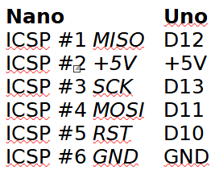
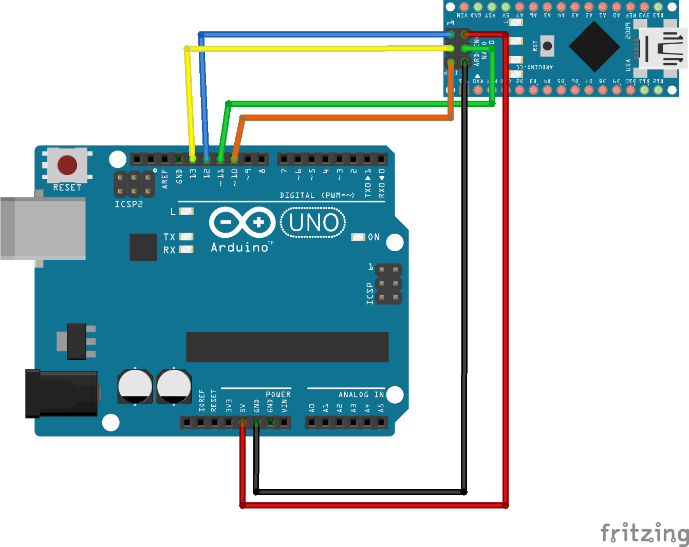

# NanoBLUpdate
Updating the Bootloader in an Arduino Nano.

Work through the slideshow and/or watch the video on YouTube...

1. Demonstration test sketch showing the "old" bootloader causing a watchdog timer timeout that crashes the Nano.
2. Using an Uno as an ISP programmer and connecting it to the Nano.
3. Updating the Nano "high fuses" to allow us to benefit from the new bootloaders smaller size.
4. Restart the Arduino IDE to pick up the updated high fuse values.
5. Updating the bootloader in the Nano.
6. Re-run the watchdog timer timeout sketch and see that it now works and the Nano is correctly reset instead of crashing.

You can see the process demonstrated here:
 - https://youtu.be/CxquKl4hISw

## Wiring the Uno to the Nano:

## Connecting the Uno to the Nano:

